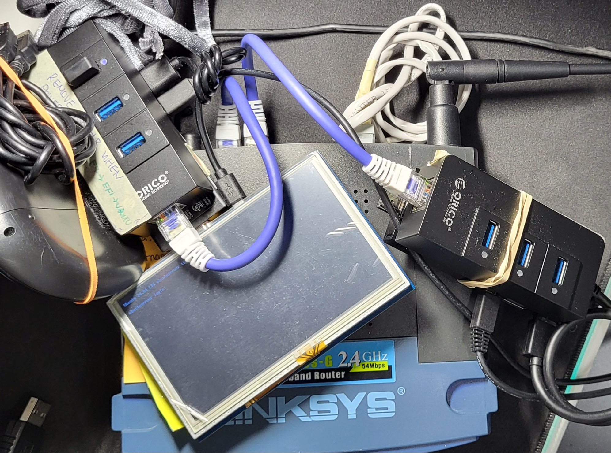

A while back I acquired three of these **Intel Compute Sticks (STK1A32SC)** for $20 each at a yard sale, it even came with the chargers! <small>(I now regret not getting more to play around with since the prices went up)</small>.

From what I've been told this products purpose was for media center applications. Unfortunately Intel does not manufacture these anymore as it huas been discontinued in **July 7th 2021**. By default it came loaded with Windows 10 or you can buy one that has Ubuntu. The ones I got were wiped for obvious reasons.

These sticks general specs have **4 CPU cores** running at **1.44 GHz**, **32GB eMMC memory**, and **2GB DDR3L-1600 RAM**. More information can found [here](https://www.intel.com/content/www/us/en/products/sku/91065/intel-compute-stick-stk1a32sc/specifications.html). It's not great, but it's also not bad. I plan to use these sticks to try out different Linux distros, learning how to work with limited resources, systems programming, embedded systems, and experiment with hardware.

As of now I have one that is running **Ubuntu Server 24.04** (I call it a *ServerDeck*) and another running **NixOS 24.05** (Still figuring out a name, maybe not..). 

Both USB 3.0 slots are used by the [Orico USB3.0 Hub with Gigabit Ethernet Converter](https://www.orico.shop/en/orico-usb30-hub-with-gigabit-ethernet-converter.html). The ethernet cable is connected to two hubs, allowing direct LAN. The *ServerDeck* uses a 5" HDMI screen to monitor resource management (using btop), and a general portable keyboard to physically communicate with the device (I ssh whenever I get the chance since the keyboard acts strange at times). All these hardware were stucked together with trusty velcro. You may notice masking tape stuck to both hubs. It's just a reminder for me to get into the BIOS and boot menu if things go awry. I had issues where the *ServerDeck* froze when booting. 

I will go into details about the *ServerDeck* and *NixOS* in another post.

I have an **WRT54GS v5.0 router** that acts as a switch for my two sticks. This router is great for modding, but that's a story for later...