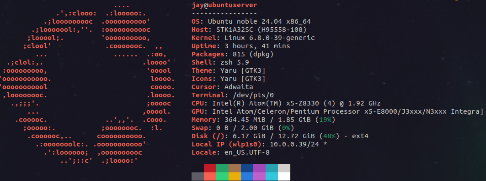
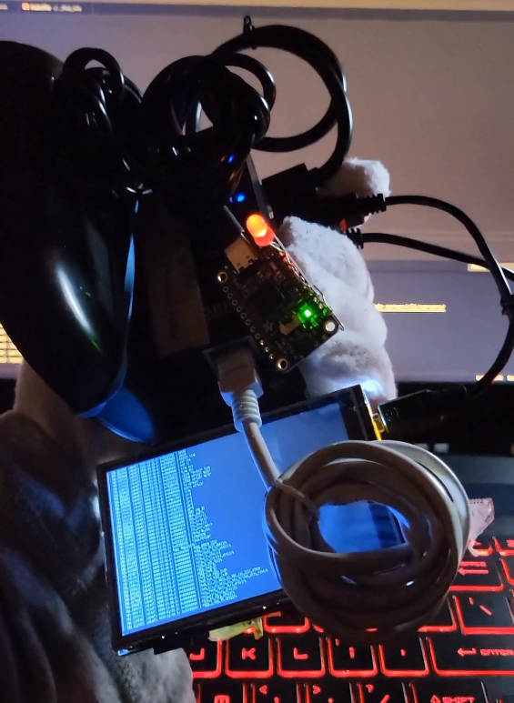
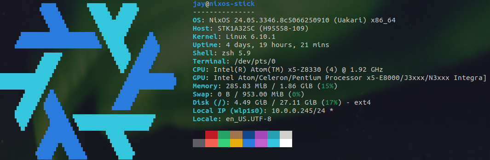

### The Purpose
Why did I choose Ubuntu Server and NixOS? Well... For my ***ServerDeck***, I was always inspired by the idea of ***CyberDecks***. I've seen a community of builds in the [cyberdeck reddit](https://www.reddit.com/r/cyberDeck/) and I wanted to try it myself. Okay, it's technically not a fully fleged DIY project, but the portability and compact size of the stick really sells it to me (I got a nice sleek silver strap that wraps around the notch). I plan carry this around with me to **log and store data** (possibly using sqlite since I have that installed currently). Also because I don't have a GUI that will slow down the device. 

As for the ***NixOS stick***, this was originally used to test out different distro's. Eventually I stuck to NixOS because the idea of managing packages and settings into one file stood out, and because of its reproducibility. I can use whatever configuration file I had and port it into another system without all the hassle. My post can't do NixOS justice so I encourage whoever is reading this to look into their [site](https://nixos.org/). With this in mind, I am thinking of using this to **store and export configuration files**.

I still have one more stick that is running [Debian](https://www.debian.org/), but I can't think of what to do with it...

### Configurations
Both my *Deck* and *NixOS* suffered from what seems to be a wireless driver issue **iwlwifi** specific to [Intel's wireless chips](https://wireless.wiki.kernel.org/en/users/drivers/iwlwifi) when plugging in the **Orico USB3.0 Hub with Gigabit Ethernet Converter**. This is what the kernel log shows:

```
iwlwifi 0000:01:00.0: Microcode SW error detected. Restarting 0x2000000
```

It seemed like the issue was due to the Ethernet port on the USB hub having conflicts with the onboard wifi chip on the stick. The solution is the same on both systems.

In Ubuntu: */etc/modprobe.d/iwlwifi.conf*
```
options iwlwifi 11n_disable=1 
options iwlwifi power_save=0
```

In NixOS: */etc/nixos/configuration.nix*
```
  environment.etc."modprobe.d/iwlwifi.conf".text = ''
    options iwlwifi 11n_disable=1
    options iwlwifi power_save=0
  '';
```

Installing *zsh* with [Oh My Zsh](https://ohmyz.sh/) on both machines helped alot with customization as well as [tmux](https://github.com/tmux/tmux/wiki).
### Compute Sticks Specs

#### Ubuntu Server 24.04 *(ServerDeck)*


Sometimes the boot up freezes and so occasionally I have to go into the BIOS, reselect the UEFI, then to the boot menu to load Ubuntu Server. Although weirdly, this issue has become less frequent if I let the deck run idle upon successfull bootup.

Originally, I wanted this to act like a portable workstation to tinker with embedded systems. I experimented with [libFTDI](https://www.intra2net.com/en/developer/libftdi/index.php) with the [Adafruit FT232H Breakout](https://learn.adafruit.com/adafruit-ft232h-breakout). This image is a simple blink program written in C.



I've also tried working with [LibMPSSE](https://ftdichip.com/software-examples/mpsse-projects/) with the [Adafruit PCA9685](https://learn.adafruit.com/16-channel-pwm-servo-driver) but the overall documentation and resources seem to be a bit abstract and I wasn't able to find others working with it. I could just use **Python** but my focus was **learning C**. 

**[NOTE]** For reference, there's a nice [guide](https://jamesachambers.com/install-ubuntu-server-18-04-on-intel-compute-stick-guide/) on installing Ubuntu Server, it's on a older model but the process should be the same.

#### NixOS 24.05


The installation process was pretty smooth, the only issues I had were not NixOS but a learning curve I have. I haven't done much with this as it is meant to store configuration files, but who knows? 


### Thoughts
Things are bound to change since it's an ongoing project and potentially a smaller part of a **BIGGER** project I am also working on.

