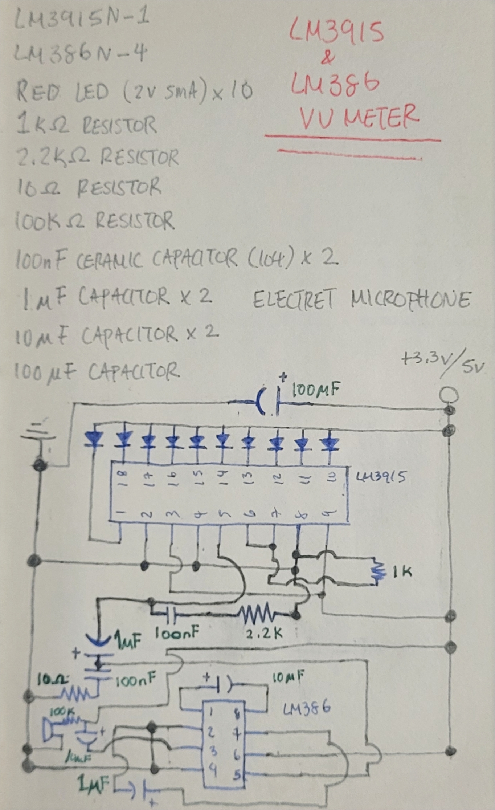
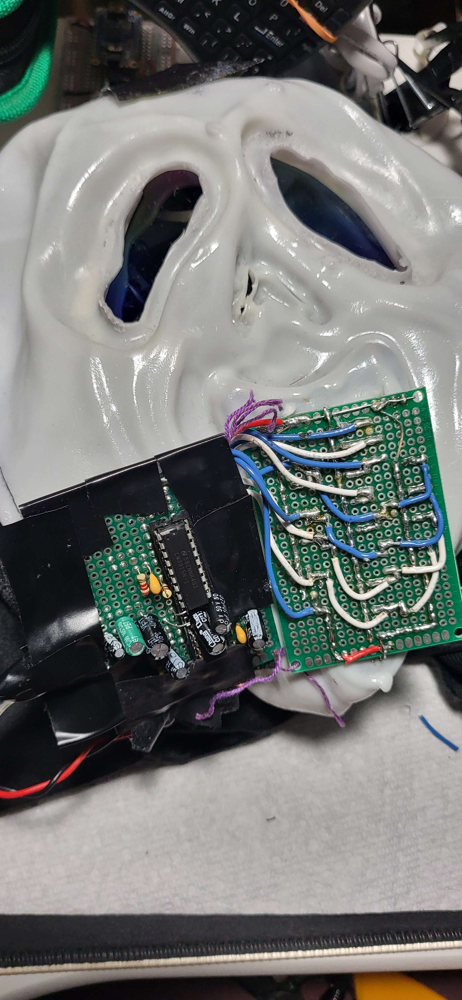
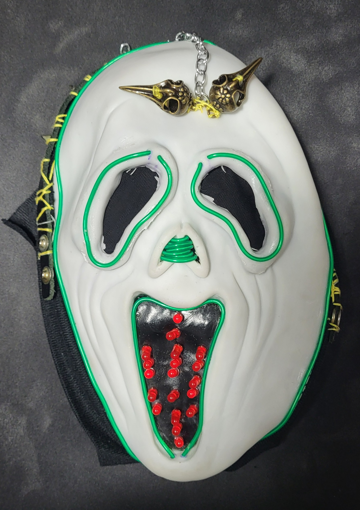
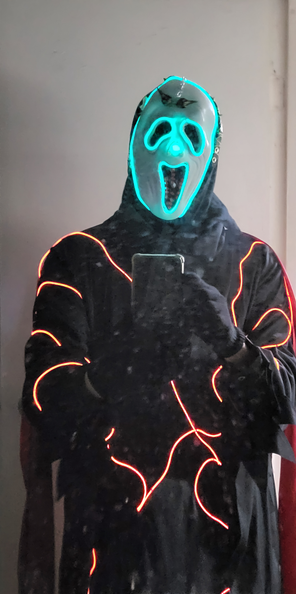

<video width="640" height="360" controls>
  <source src="{{ '../assets/img/cosplay/ghostface-voice-changer.mp4' | relative_url }}" type="video/mp4">
</video>

Well, an unexpecting blog post... Let me explain.

### Why?
To start off, recently I've been going to pop culture and anime conventions called [FanExpo](https://fanexpohq.com/fanexpocanada/) and [AnimeNorth](https://www.animenorth.com/). Why I wanted to go was because of cosplay as I've been wanting to do that for a long time.

Cosplay was something I had been curious about because of the creative freedom one can have. So I decided to explore it.

### Okay But What Is This Cosplay?
I'm sure you've heard of the movie franchise [Scream](https://en.wikipedia.org/wiki/Scream_(franchise)). A popular reoccuring character is *Ghostface (you see where this is going)*. Seeing how there are several variations of the costumes. I decided that I wanted to make my own. I'm not sure what aesthetic my costume fits as I just went along with whatever "looks cool".

Now that's out of the way, let's break down how I created this cosplay.

### How?
A picture I took from my book where I document my electronics projects. It lists the hardware used and the schematic. I follow this format for every ongoing project.
 

Yes I could've used a software tool to create this schematic but I really wanted to draw it out since I enjoying do so <small>(sorry for the electrical engineers that are looking at this!)</small>.

The [LM3915](https://www.mouser.com/datasheet/2/405/lm3915-443929.pdf) is an **Integrated Circuit (IC) or Chip** that drives LEDs or anything similar like a [VU (Volume Unit) meter](https://en.wikipedia.org/wiki/VU_meter). This is then connected to an audio amplifier called [LM386](https://en.wikipedia.org/wiki/LM386#:~:text=The%20LM386%20is%20an%20integrated,amplifiers%2C%20and%20hobby%20electronics%20projects.) to boost the signal that is connected to a condenser microphone. In the video above, you can see this in action. As for powering this thing. I repurposed a broken iPhone charger cable and soldered a barrel plug to it, then I used a [LM3940IS](https://www.ti.com/lit/ds/symlink/lm3940.pdf) which drops my 5V to 3.3V. This isn't listed in the picture since it was an afterthought. I did this to ensure that I wasn't overloading my circuit (which now that I think about it may not be necessary).

Here's my "handy work" <small>(don't mind the messy placement of electrical tape...)</small>  The most challenging part was having to individually poke every LED leg into the mask and solder that to the LM3915.

The voice changer was the easiest part of the mask. I used the [Adafruit Wave Shield Voice Changer](https://learn.adafruit.com/wave-shield-voice-changer/overview), followed all the instructions, and it worked like a charm!

So what you see up til now is the first iteration of the mask when I went to AnimeNorth. I made some minor changes when I went to FanExpo. I used green [EL (Electroluminescent) Wires](https://learn.adafruit.com/el-wire/overview) for my mask, I followed this [tutorial](https://www.youtube.com/watch?v=_JGcTR7psFs) to add some light. The Red EL wires are for the outfit that are sewn (with help) to the robe.

### That's It!
For this cosplay that is... I would like to come back and rework this. For now, I'll move on!
