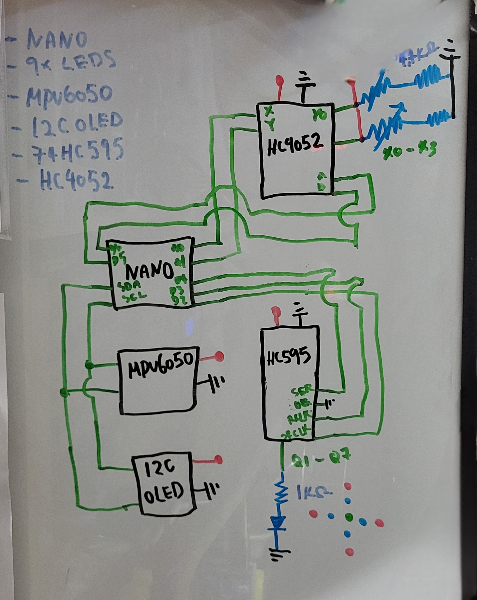

<video width="640" height="360" controls>
  <source src="{{ '../assets/img/crude_sensor_glove/glove_demo.mp4' | relative_url }}" type="video/mp4">
</video>

I know, this looks very **crude**... It kinda works!?

### Explaination
As someone who is into the cyberpunk/sci-fi aesthetic, I always see gloves as a big part of the theme. Naturally, questioning how these things work and if they are possible made me want to take on this project. Now I'm not making some next biggest and greatest thing (the demo video clearly shows that), it's moreso a learning experience for myself. So I did some surfing online and see what other makers have been doing.

### Hardware and Software
I've drew a schematic and also listed the components. One thing I forgot to list are the pressure sensors. *"Why didn't you use flex sensors??"* I wanted to, but the cost of each flex sensor are expensive! (**$24.09 for 4.5"** and **$14.99 for 2.2"** each) Plus since this was experimental, I didn't mind as much.

After I finished my project, I discovered something called [Conductive Rubber Cords](https://www.adafruit.com/product/519) which can be a possible alternative.


<sub>(Sorry for the electrical engineers looking at this!)</sub>

I used multiplexers [HC4052](https://www.sparkfun.com/datasheets/Components/General/74HC4052.pdf) and [HC595](https://www.sparkfun.com/datasheets/IC/SN74HC595.pdf) to avoid an issue I had that I'll list later.

The [MPU6050](https://howtomechatronics.com/tutorials/arduino/arduino-and-mpu6050-accelerometer-and-gyroscope-tutorial/) I used are to determine where the glove is positioned (up, down, left, right). The LEDS will help indicate that as shown in the video.

The **I2C OLED** is for showing pressure sensor values:
* X0 is thumb
* X1 is index finger
* X2 is middle finger
* X3 is ring finger
* Y0 is pinky

This will make sense for the code below.


Before coding, I'll list the libraries I used:
Libraries used:
* [Adafruit_MPU6050](https://github.com/adafruit/Adafruit_MPU6050)
* [UG82](https://github.com/olikraus/u8g2)
* [HC595](https://github.com/johnnyb/Shifty)
* [HC4052](https://github.com/RobTillaart/HC4052)

Now here's my small program.
```cpp
#include <Arduino.h>
#include <Adafruit_MPU6050.h>
#include <Adafruit_Sensor.h>
#include <Wire.h>
#include <U8x8lib.h>
#include <Shifty.h>
#include <HC4052.h>

#define HC4025_X A0
#define HC4025_Y A1

// #define mid_grn_LED     1

// =====ACCELERATION.X======
// LEFT
#define left_ylw_LED 0
#define left_red_LED 1
#define LEFT_MID 7
#define LEFT_HIGH 10

// RIGHT
#define right_ylw_LED 2
#define right_red_LED 3
#define RIGHT_MID -7
#define RIGHT_HIGH -8
// =====ACCELERATION.X======

// =====ACCELERATION.Y======
// UP
#define up_ylw_LED 4
#define up_red_LED 5
#define UP_MID 6
#define UP_HIGH 8

// DOWN
#define down_ylw_LED 6
#define down_red_LED 7
#define DOWN_MID -7
#define DOWN_HIGH -9
// =====ACCELERATION.Y======

Shifty shift;
int clock = 2, latch = 3, data = 4;

U8X8_SSD1306_128X64_NONAME_HW_I2C u8x8(U8X8_PIN_NONE);
char buffer[300];

int A = 5, B = 6, enable = 255;
HC4052 analog_mp(A, B, enable);

Adafruit_MPU6050 mpu;

void setup()
{
  Serial.begin(115200);

  shift.setBitCount(8);
  shift.setPins(data, clock, latch);

  u8x8.begin();
  u8x8.clear();
  u8x8.setFont(u8x8_font_chroma48medium8_r);
  u8x8.drawString(3, 3, "startup");

  pinMode(A, OUTPUT);
  pinMode(B, OUTPUT);

  if (!mpu.begin())
  {
    u8x8.clear();
    Serial.println("Failed to find MPU6050");
    u8x8.drawString(0, 3, "No MPU6050");
  }
  else
  {
    mpu.setAccelerometerRange(MPU6050_RANGE_8_G);
    mpu.setGyroRange(MPU6050_RANGE_500_DEG);
    mpu.setFilterBandwidth(MPU6050_BAND_21_HZ);

    u8x8.clear();

    u8x8.drawString(1, 0, "X0:");
    u8x8.drawString(1, 2, "X1:");
    u8x8.drawString(1, 4, "X2:");
    u8x8.drawString(1, 6, "X3:");
    u8x8.drawString(10, 0, "Y0:");

    delay(100);
  }
}

void acceleration(sensors_event_t a)
{
  shift.writeBit(left_ylw_LED, a.acceleration.x > LEFT_MID);
  shift.writeBit(left_red_LED, a.acceleration.x > LEFT_HIGH);

  shift.writeBit(right_ylw_LED, a.acceleration.x < RIGHT_MID);
  shift.writeBit(right_red_LED, a.acceleration.x < RIGHT_HIGH);

  shift.writeBit(up_ylw_LED, a.acceleration.y > UP_MID);
  shift.writeBit(up_red_LED, a.acceleration.y > UP_HIGH);

  shift.writeBit(down_ylw_LED, a.acceleration.y < DOWN_MID);
  shift.writeBit(down_red_LED, a.acceleration.y < DOWN_HIGH);
}

void analog_read()
{
  delay(50);

  for (int channel_x = 0; channel_x < 4; channel_x++)
  {
    analog_mp.setChannel(channel_x);
    int sensor_x = map(analogRead(HC4025_X), 0, 862, 0, 1023);
    // pow(analogRead(HC4025_X), 1.5);  
    // map(analogRead(HC4025_X), 0, 862, 0, 1023);

    if(analog_mp.getChannel() == 0) { sensor_x = map(analogRead(HC4025_X),0,89,0,100); }
    if(sensor_x > 1023) { sensor_x = 1023; }

    sprintf(buffer, "X%d:%d  ", channel_x, sensor_x);
    u8x8.drawString(1, channel_x * 2, buffer);
  }

  for (int channel_y = 0; channel_y < 2; channel_y++)
  {
    analog_mp.setChannel(channel_y);
    int sensor_y = map(analogRead(HC4025_Y), 0, 862, 0, 1023);
    // pow(analogRead(HC4025_Y), 1.5); 
    // map(analogRead(HC4025_Y), 0, 862, 0, 1023);

    if (analog_mp.getChannel() == 0)
    {
      if(sensor_y > 1023) { sensor_y = 1023; }
      sprintf(buffer, "Y%d:%d  ", channel_y, sensor_y);
      u8x8.drawString(9, channel_y, buffer);
    }
  }
}

void loop()
{
  sensors_event_t a, g, temp;
  mpu.getEvent(&a, &g, &temp);
  acceleration(a);
  analog_read();
}
```


(to note: I used [Platform IO](https://platformio.org/) as it was VSCode compatiable)

### Problems
Remember that issue? I encountered a phenonmenon called [Crosstalk](https://en.wikipedia.org/wiki/Crosstalk). That's not all! The thumb (X0) didn't seem to read and values and the ring finger (X3) is always maxed out. I couldn't figure out why though...

### That's all
I learned alot. Soon I'll revisit this and improve on it.