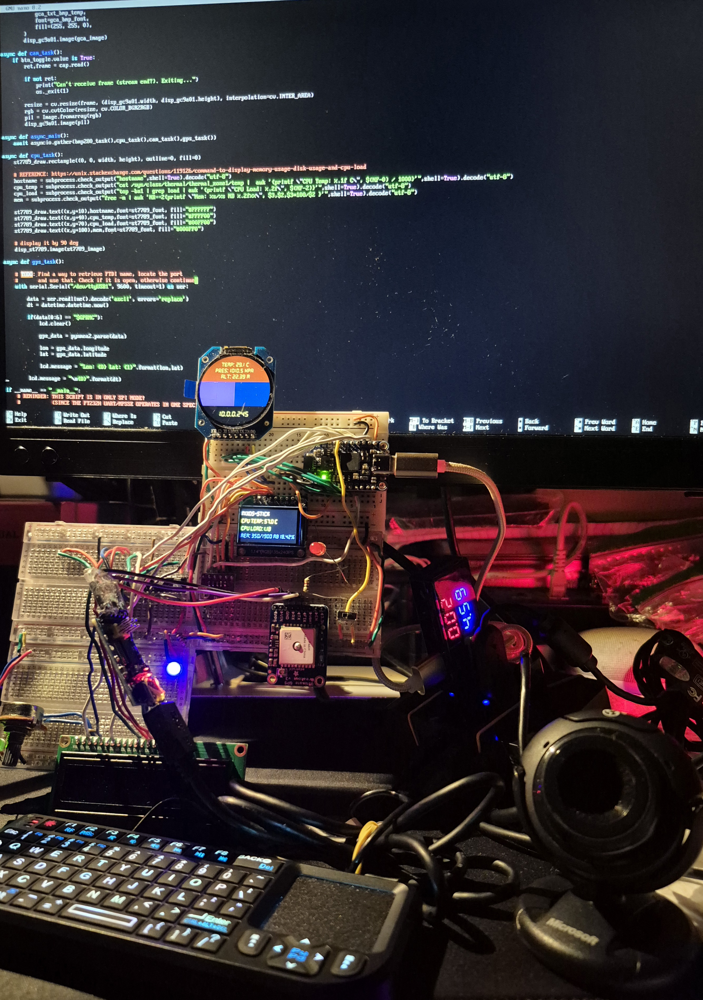
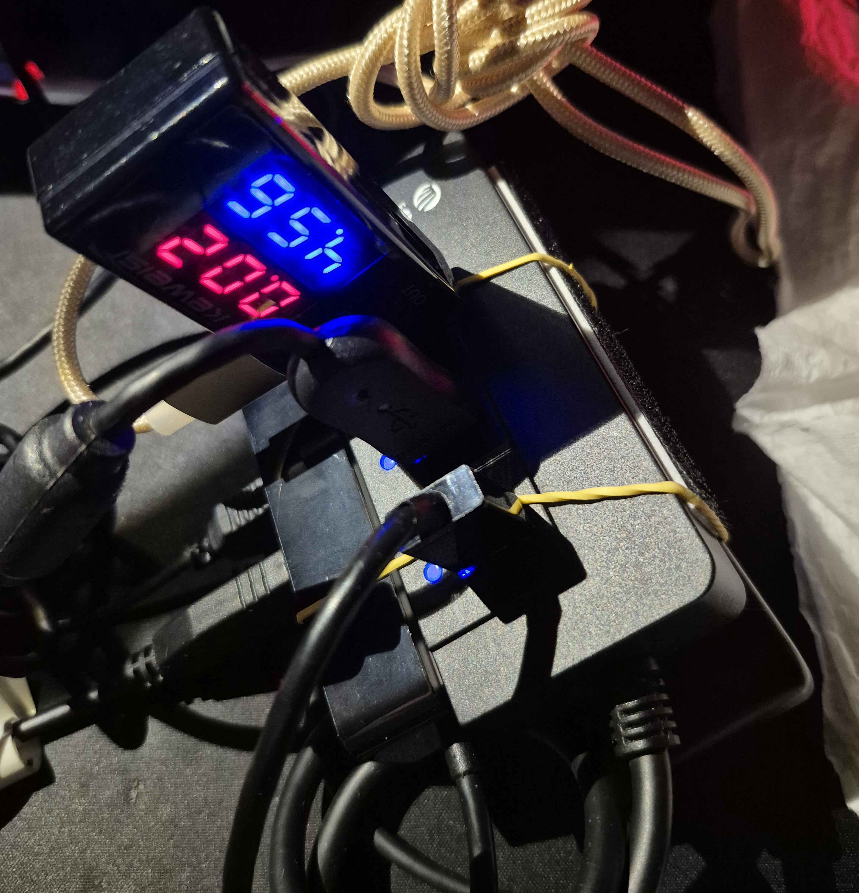

Back with another Cyberdeck post!

### Obsession Much?
I won't argue with that... But because of its compact size, I can't help but tinker and build more upon it!

A few (maybe alot) has changed. For one, the idea of using my ***ServerDeck*** as my go to has switched to using my ***Nix-Stick*** <sub>(new name change..)</sub>. This change was due to easier package and environment control, which will be needed when I bring this to do some field testing. More will be explained later.

### What Does It Look Like?


#### In Action
<video width="900" height="1600" controls>
  <source src="{{ '../assets/img/nixos_cyberdeck/demo-nixos-cyberdeck.mp4' | relative_url }}" type="video/mp4">
</video>


Yep, it's a total mess... Let's start breaking down what I have:

#### Hardware

**Compute Stick setup:**
- Wireless Mini Keyboard
- USB Hub with Voltage & Current Tester
- **[AdaFruit FT232H (USB-C)](https://learn.adafruit.com/adafruit-ft232h-breakout)**
- FTDI **FT232RL** USB to TTL adapter
- USB Hubs:
    - **[Orico 3x USB 3.0 port with Gigabit Ethernet Adapter](https://www.orico.cc/usmobile/product/detail/id/3306)**
    - **[Unitek 4x USB 3.0 port with USB-C Power Port](https://www.unitek-products.com/products/uhub-q4-4-ports-powered-usb-c-hub-with-usb-c-power-port?keyword=4%20port)**

**Breadboard setup:**
- Displays: 
    - **GC9A01**      (round display)
    - **ST7789**      (square display)
    - **16x2 LCD**    (rectangle display)
- **[BME280](https://www.bosch-sensortec.com/products/environmental-sensors/humidity-sensors-bme280/)** (Barometric sensor)
- **[AdaFruit Ultimate GPS V3](https://learn.adafruit.com/adafruit-ultimate-gps)**
- Shift Registers:
    - **[74HC595](https://learn.adafruit.com/74hc595/overview)**
    - **[74HC165](https://dronebotworkshop.com/shift-registers/#Extra_Input_Ports_with_the_74HC165)**
- 10K potentiometer
- Mini SPST Switch

#### Close up photo of the **Nix-Stick:** 
Guess where the computer is!


### Software
In a [previous post](https://bnzel.github.io/2024-08-07-ServerDeck-and-NixOS/) when I was just focusing on my ***ServerDeck***, I opted to use **[LibMPSSE](https://ftdichip.com/software-examples/mpsse-projects/libmpsse-spi-examples/)** that's in C. I mentioned the documentation being a bit difficult to grasp and so this time I went with **[Adafruit_Blinka](https://github.com/adafruit/Adafruit_Blinka)** that's written in Python. There's alot of [examples and tutorials](https://learn.adafruit.com/circuitpython-on-raspberrypi-linux) from Adafruit themselves that it's easier to get things tested!

What's driving the whole circuit is the **[FT232H](https://learn.adafruit.com/circuitpython-on-any-computer-with-ft232h)**. Currently I am using the **GC9A01** to display stats from the **BME280**, **ST7789** is taking the computer's: Hostname, CPU Temp, CPU Load, and Memory Usage. Finally the **16x2 LCD** *(potentiometer is used to adjust the backlight)* is connected to the **74HC595** for extra outputs, showing longitude and latitude *(datetime is separate)* from **AdaFruit Ultimate GPS V3**, it is showing zeroes because you'll have to be outside in order for it to work. I haven't used the **74HC165** yet.

The **mini SPST switch** is used to switch over to start webcam streaming **(OpenCV)**, a red LED is just for indication. The green and blue LEDs are to test if there's voltage across connecting breadboards.

Here's the code that drives this circuit:
#### main.py:
```python
import board
from board import SCK, MOSI, MISO

import busio
import digitalio
from adafruit_rgb_display.st7789 import ST7789
from PIL import Image, ImageDraw, ImageFont

from adafruit_rgb_display.gc9a01a import GC9A01A

import adafruit_bmp280

import numpy as np
import cv2 as cv
import asyncio
import os

import time
import subprocess

import adafruit_character_lcd.character_lcd as character_lcd
import adafruit_74hc595

import wws_74hc165

import serial
import usb.core
import sys
import pynmea2
import datetime

spi = busio.SPI(clock=SCK, MOSI=MOSI, MISO=MISO)

def init_display(disp,cs,dc,reset,rotate,w,h,x_off,y_off,BAUDRATE=24000000):
    CS_PIN = cs
    DC_PIN = dc
    RESET_PIN = reset
    display = disp(
        spi,
        rotation=rotate,
        width=w,
        height=h,
        x_offset=x_off,
        y_offset=y_off,
        baudrate=BAUDRATE,
        cs=digitalio.DigitalInOut(CS_PIN),
        dc=digitalio.DigitalInOut(DC_PIN),
        rst=digitalio.DigitalInOut(RESET_PIN)
    )
    return display

def rotation(display):
    height=0
    width=0
    if display.rotation % 180 == 90:
        height = display.width  # swap height/width to rotate it to landscape
        width = display.height
    else:
        width = display.width  # swap height/width to rotate it to landscape
        height = display.height

    return height, width

def draw_image(disp,width,height,fill=0):
    disp.fill(0)
    disp_image = Image.new("RGB", (width,height))
    disp_draw = ImageDraw.Draw(disp_image)

    return disp_image, disp_draw

async def bmp280_task():
    if btn_toggle.value is False:
        gca_draw.rectangle((0, 0, disp_gc9a01.width, disp_gc9a01.height // 2 - 30), fill=(155, 50, 0))
        gca_txt_bmp_temp = "    Temp: {:.1f} C".format(bmp280.temperature) + "\nPres: {:.1f} hPa".format(bmp280.pressure) + "\n    Alt: {:.2f} M".format(bmp280.altitude)
        gca_draw.text(
            (disp_gc9a01.width // 2 - 70 , disp_gc9a01.height // 2 - 100),
            gca_txt_bmp_temp,
            font=gca_bmp_font,
            fill=(255, 255, 0),
        )
        disp_gc9a01.image(gca_image)

async def cam_task():
    if btn_toggle.value is True:
        ret,frame = cap.read()

        if not ret:
            print("Can't receive frame (stream end?). Exiting...")
            os._exit(1)

        resize = cv.resize(frame, (disp_gc9a01.width, disp_gc9a01.height), interpolation=cv.INTER_AREA)
        rgb = cv.cvtColor(resize, cv.COLOR_BGR2RGB)
        pil = Image.fromarray(rgb)
        disp_gc9a01.image(pil)

async def async_main():
    await asyncio.gather(bmp280_task(),cpu_task(),cam_task(),gps_task())

async def cpu_task():
    st7789_draw.rectangle((0, 0, width, height), outline=0, fill=0)

    # REFERENCE: https://unix.stackexchange.com/questions/119126/command-to-display-memory-usage-disk-usage-and-cpu-load
    hostname = subprocess.check_output("hostname",shell=True).decode("utf-8")
    cpu_temp = subprocess.check_output("cat /sys/class/thermal/thermal_zone1/temp |  awk '{printf \"CPU Temp: %.1f C\", $(NF-0) / 1000}'",shell=True).decode("utf-8")
    cpu_load = subprocess.check_output("top -bn1 | grep load | awk '{printf \"CPU Load: %.2f\", $(NF-2)}'",shell=True).decode("utf-8")
    mem = subprocess.check_output("free -m | awk 'NR==2{printf \"Mem: %s/%s MB %.2f%%\", $3,$2,$3*100/$2 }'",shell=True).decode("utf-8")

    st7789_draw.text((x,y+10),hostname,font=st7789_font, fill="#FFFFFF")
    st7789_draw.text((x,y+40),cpu_temp,font=st7789_font, fill="#FFFF00")
    st7789_draw.text((x,y+70),cpu_load,font=st7789_font, fill="#00FF00")
    st7789_draw.text((x,y+100),mem,font=st7789_font, fill="#000FF0")

    # display it by 90 deg
    disp_st7789.image(st7789_image)

async def gps_task():

    # TODO: Find a way to retrieve FTDI name, locate the port
    #       and use that. Check if it is open, otherwise continue 
    with serial.Serial("/dev/ttyUSB1", 9600, timeout=1) as ser:

        data = ser.readline().decode('ascii', errors='replace')
        dt = datetime.datetime.now().strftime("%Y/%m/%d %H:%M")

        if(data[0:6] == "$GPRMC"):
            lcd.clear()

            gps_data = pynmea2.parse(data)

            lon = gps_data.longitude
            lat = gps_data.latitude

            lcd.message = "Lon:{0} Lat:{1}".format(lon,lat)
            print(lcd.message)

        lcd.message = "\n{0}".format(dt)

if __name__ == "__main__":
    # REMINDER: THIS SCRIPT IS IN ONLY SPI MODE!
    #           (SINCE THE FT232H UART/MPSSE OPERATES IN ONE SPECIFIC MODE)

    # -----74HC165 IS INPUT ONLY-----
    _74hc165_isr_latch = board.D5
    _74hc165_isr = wws_74hc165.ShiftRegister74HC165(spi, _74hc165_isr_latch, 1)

    # -----74HC595 IS OUTPUT ONLY-----
    _74hc595_isr_latch = digitalio.DigitalInOut(board.D6)
    _74hc595_isr = adafruit_74hc595.ShiftRegister74HC595(spi, _74hc595_isr_latch, 1)

    # connecting LCD to 74HC595 
    lcd_rs = _74hc595_isr.get_pin(0)
    lcd_en = _74hc595_isr.get_pin(1)
    lcd_d7 = _74hc595_isr.get_pin(2)
    lcd_d6 = _74hc595_isr.get_pin(3)
    lcd_d5 = _74hc595_isr.get_pin(4)
    lcd_d4 = _74hc595_isr.get_pin(5)

    lcd_backlight = _74hc595_isr.get_pin(6)

    lcd_columns = 16
    lcd_rows = 2

    lcd = character_lcd.Character_LCD_Mono(lcd_rs, lcd_en, lcd_d4, lcd_d5, lcd_d6, lcd_d7, lcd_columns, lcd_rows, lcd_backlight)
    lcd_backlight.value = True
    lcd.message = "BOOTING\nUP..."

    # clear old outputs for incoming ones
    subprocess.run(["clear"])

    # switch for camera mode for round display
    btn_toggle = digitalio.DigitalInOut(board.D4)
    btn_toggle.direction = digitalio.Direction.INPUT

    # list connected USB devices
    print("ls /dev/video* : ",subprocess.check_output("ls /dev/video* | grep -oP '/dev/video\d+' | tr '\n' ' ' | sed 's/ $//'",shell=True))
    print("ls /dev/ttyUSB* : ",subprocess.check_output("ls /dev/ttyUSB* | grep -oP '/dev/ttyUSB\d+' | tr '\n' ' ' | sed 's/ $//'",shell=True))

    # camera check
    cap = cv.VideoCapture(-1)
    if not cap.isOpened():
        print("Cannot open camera...")
    cap.set(cv.CAP_PROP_FPS,30)

    # barometer setup for round display
    bmp280 = adafruit_bmp280.Adafruit_BMP280_SPI(spi, digitalio.DigitalInOut(board.C7))
    gca_bmp_font = ImageFont.truetype('./DS-DIGIT.TTF',20)

    # ----------------set up round display ----------------
    disp_gc9a01 = init_display(GC9A01A,board.C6,board.C5,board.C4,180,240,240,0,0)
    gca_image, gca_draw = draw_image(disp_gc9a01,disp_gc9a01.width,disp_gc9a01.height)

    gca_draw.rectangle((0, 0, disp_gc9a01.width, disp_gc9a01.height // 2 - 30), fill=(155, 50, 0))                          # upper rectangle
    gca_draw.rectangle((0, 90, disp_gc9a01.width // 2, disp_gc9a01.height // 10 + 150), fill=(105, 50, 150))                # left rectangle
    gca_draw.rectangle((120, 90, disp_gc9a01.width // 2 + 150, disp_gc9a01.height // 10 + 150), fill=(10, 50, 100))         # right rectangle

    gca_font = ImageFont.truetype('./DS-DIGIT.TTF',25)
    gca_txt_ip = subprocess.check_output("ip -4 addr | grep -oP '(?<=inet\s)\d+(\.\d+){3}' | grep -v '127\.0\.0\.1'",shell=True).decode("utf-8")
    gca_draw.text(
        (disp_gc9a01.width // 2 - 50 , disp_gc9a01.height // 2 + 70),
        gca_txt_ip,
        font=gca_font,
        fill=(255, 255, 0),
    )
    disp_gc9a01.image(gca_image)
    # ------------------------------------------------------


    # ---------------- set up tft display ----------------
    x = 0
    y = -2
    disp_st7789 = init_display(ST7789,board.C3,board.C2,board.C1,90,135,240,53,40)
    height,width = rotation(disp_st7789)
    st7789_image, st7789_draw = draw_image(disp_st7789,width,height)
    st7789_font = ImageFont.truetype('./DS-DIGIT.TTF',23)
    # ------------------------------------------------------

    lcd.clear()

    # gracefully exit when CTRL+C
    try:
        while True:
            asyncio.run(async_main())

    # offload camera, lcd, and exit
    except KeyboardInterrupt:
        cap.release()
        lcd.clear()
        lcd.backlight = False
        os._exit(1)
        print("\nCancelled...")
```

#### Of Course There's Trouble...
There is a forum discussing [how difficult it is to use Python in NixOS](https://discourse.nixos.org/t/why-is-it-so-hard-to-use-a-python-package/19200/3) due to the way how regular Linux Distro's link C++ .so files. Luckily there was a script I found in the **[GitHub documentation](https://github.com/NixOS/nixpkgs/blob/49829a9adedc4d2c1581cc9a4294ecdbff32d993/doc/languages-frameworks/python.section.md#how-to-consume-python-modules-using-pip-in-a-virtual-environment-like-i-am-used-to-on-other-operating-systems-how-to-consume-python-modules-using-pip-in-a-virtual-environment-like-i-am-used-to-on-other-operating-systems)** that I modified for my needs:

#### default.nix
```
with import <nixpkgs> { };

let
  pythonPackages = python3Packages;
in pkgs.mkShell rec {
  name = "impurePythonEnv";
  venvDir = "./.venv";
  buildInputs = [
    # A Python interpreter including the 'venv' module is required to bootstrap
    # the environment.
    pythonPackages.python

    # This execute some shell code to initialize a venv in $venvDir before
    # dropping into the shell
    pythonPackages.venvShellHook

    # Those are dependencies that we would like to use from nixpkgs, which will
    # add them to PYTHONPATH and thus make them accessible from within the venv.
    pythonPackages.numpy
    pythonPackages.requests
    pythonPackages.pyftdi
  
    # In this particular example, in order to compile any binary extensions they may
    # require, the Python modules listed in the hypothetical requirements.txt need
    # the following packages to be installed locally:
    libusb1
   ];

  # Run this command, only after creating the virtual environment
#  postVenvCreation = ''
#    unset SOURCE_DATE_EPOCH
#    pip install -r requirements.txt
#  '';

 packages = [ pkgs.screen ];

# For linking OpenCV libraries
 LD_LIBRARY_PATH = lib.makeLibraryPath [ pkgs.stdenv.cc.cc ];

 shellHook = ''
   alias c="clear"
   alias h="history -c"
   alias la="ls -la"
   
   source .venv/bin/activate
   which python3
   python3 sanity_test.py
  # python3 blink_test.py
   ls /dev/ttyUSB*
   ls /dev/video*
 '';


  # Now we can execute any commands within the virtual environment.
  # This is optional and can be left out to run pip manually.
  postShellHook = ''
    # allow pip to install wheels
    unset SOURCE_DATE_EPOCH
    BLINKA_FT232H=1
  '';

}
```

Since this environment relies on the PIP package, the following is the libraries I've used:

#### requirements.txt
```
Adafruit-Blinka==8.56.0
adafruit-blinka-displayio==2.1.7
adafruit-circuitpython-74hc595==1.4.6
adafruit-circuitpython-bitmap_font==2.2.0
adafruit-circuitpython-bmp280==3.3.6
adafruit-circuitpython-busdevice==5.2.11
adafruit-circuitpython-charlcd==3.5.1
adafruit-circuitpython-connectionmanager==3.1.3
adafruit-circuitpython-framebuf==1.6.7
adafruit-circuitpython-mcp230xx==2.5.16
adafruit-circuitpython-register==1.10.2
adafruit-circuitpython-requests==4.1.10
adafruit-circuitpython-rgb-display==3.13
adafruit-circuitpython-ticks==1.1.2
adafruit-circuitpython-typing==1.11.2
Adafruit-PlatformDetect==3.77.0
Adafruit-PureIO==1.1.11
binho-host-adapter==0.1.6
brotlicffi==1.1.0.0
certifi==2024.8.30
cffi==1.17.1
charset-normalizer==3.3.2
idna==3.10
numpy==1.26.4
opencv-python-headless==4.11.0.86
pillow==11.1.0
pycparser==2.22
pyftdi==0.55.4
pynmea2==1.19.0
pyserial==3.5
pyusb==1.2.1
requests==2.32.3
sysv_ipc==1.1.0
typing_extensions==4.12.2
urllib3==2.2.3
woolseyworkshop-circuitpython-74hc165==1.0.0
```

### Wait, What About Your ServerDeck?
Don't worry, it's still up and running! I probably might use this to handle whatever incoming data ***Nix-Stick*** is processing through the USBs Ethernet adapter like I had [before](https://bnzel.github.io/2024-08-03-Intel-Compute-Sticks/).

### So What Now?
Hmm.... More prototyping? Get this outside? There's plenty of things to do with this Compute Stick and frankly I am suprised it's able to handle a lot.