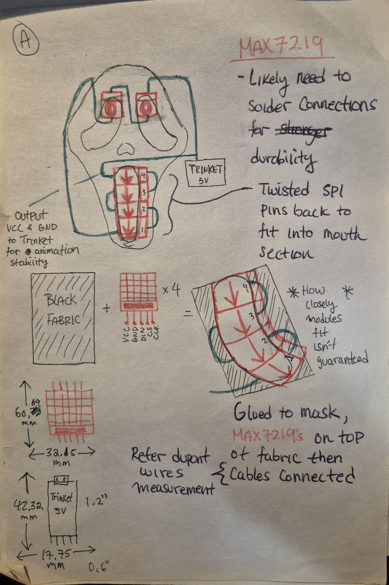
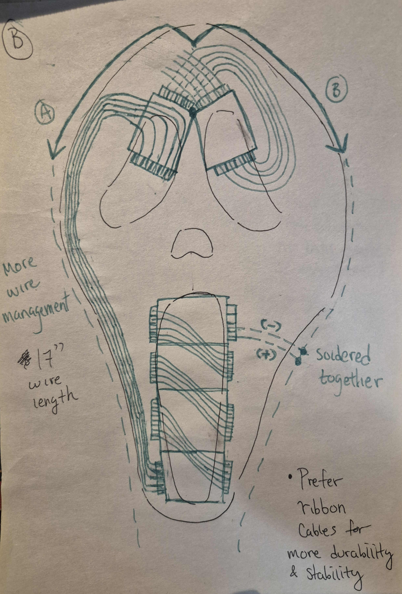
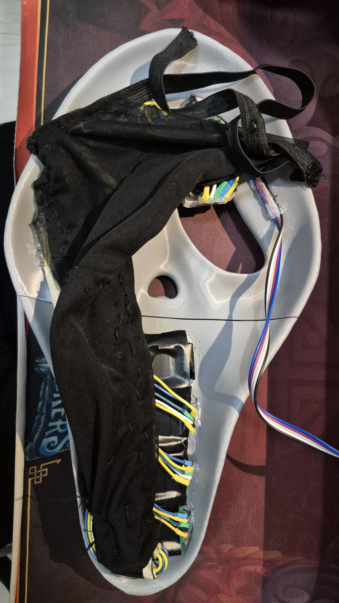
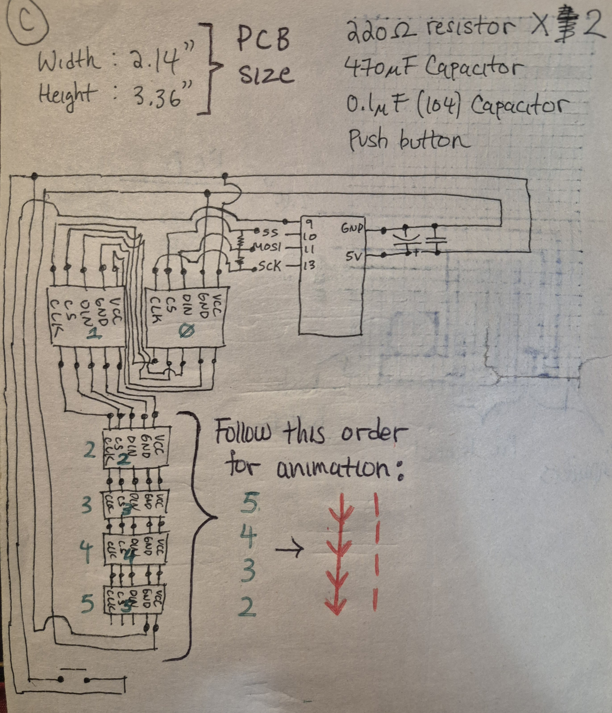
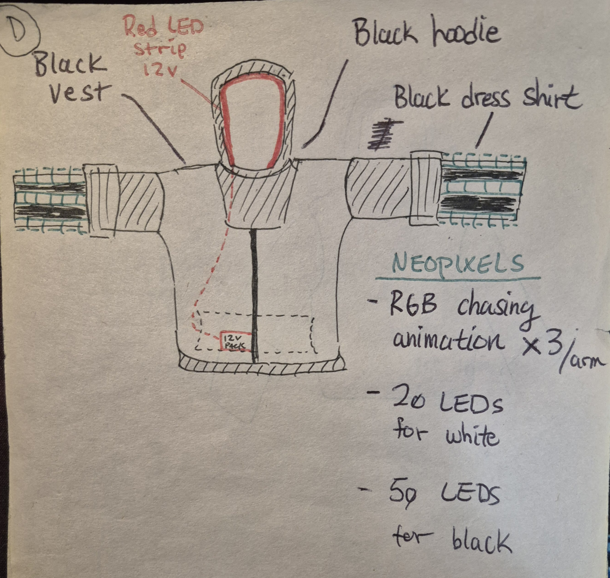

Back from [AnimeNorth](https://animenorth.com/) 2025!

If I am being honest, I wasn't satisfied with my [previous ghostface cosplay](https://bnzel.github.io/2024-08-31-Cosplay/) because it wasn't "flashy". Well this time I aimed to do just that!

As always lets list out the components:

### Hardware
- **[Adafruit Pro Trinket (5V 16MHz)](https://www.canadarobotix.com/products/2036)**
- Six of **[8x8 LED Matrix](https://creatroninc.com/products/8x8-led-matrix-board?_pos=4&_sid=40c0bf939&_ss=r)**
- 12V LED strip of any colour
- 12V battery pack
- Two of 220Ω Resistors
- 470uF Capacitor
- 0.1uF (104) Capacitor
- Tactile push button

### Brainstorming Sketches

 
Out of everything I had to do, the placement of the LED matrix's with the mask was the most difficult. It had not only look presentable, but not completely blind me (which did anyway but would've been worse...). I used hot glue to secure them together.

I think I've went a little to technical on measuring the component sizes *(bottom left)* but I'd wanted to make sure what PCB dimensions was suitable.

The black fabric was to conceal myself and to provide a base where the mouth section of the LEDS can lay on.

The Trinket was contained into a black PLA material box.



This was the **SCARY** part.... I knew if something were to break, I would have to tediously check individual modules, troubleshoot and potentially resolder wires. I was lucky because it started glitching out when I was leaving the con! Yay..... I haven't checked yet but I suspect it's loose wires coming from the PCB which is easier to fix. At this point I feel like Mr. Ghostface has had its run, so I'll leave it be.

The dashed lines was me thinking where to place the wires, eventually I ended up choosing **(A)**

I added a note where ribbon cables are preferable because of their durability however I wasn't able to purchase one on time and the event was approaching.

Here's the actual setup:





I feel like this should have been the first page...

The animation order I wrote was to remind myself to rotate the matrix's 90 degrees so that the arrows are pointing down. The eye's are at their default position, ignoring the rotated text.

The capacitors on the Trinket are to smooth out any random spikes of voltage that can glitch out the animations. This also applies to the resistors on the data pins.



And finally the outfit. I didn't list NeoPixel LED strips on the hardware section because it was a last minute thought and I feel like it wasn't necessary. The idea should be the same, just hook them up to any avaliable digital pins. The 20, 50 LEDs are me trying to budget and reuse NeoPixel strips but I opted for the white strips.

The hoodie has a 12V red LED strip but for some reason the store where I got it mislabeled it, so now it's **blue**.

### Demo 

<video width="800" height="1920" controls>
  <source src="{{ '../assets/img/cosplay_v2/ghostface_v2_demo.mp4' | relative_url }}" type="video/mp4">
</video>

### Here's The Code
```cpp
#include <MD_Parola.h>
#include <MD_MAX72xx.h>
#include <SPI.h>
#include "MD_EyePair.h"
#include <Adafruit_NeoPixel.h>


// pin definitions

// BUTTON
const int btnPin = 9;
int btnLastState = HIGH;
int btnCurrState;
int zoneState = 0;

// NEOPIXEL
#define LED_PIN 1
#define LED_COUNT 15
Adafruit_NeoPixel strip(LED_COUNT, LED_PIN, NEO_GRB + NEO_KHZ800);

// MAX7219
// HARDWARE SPI
#define HARDWARE_TYPE MD_MAX72XX::GENERIC_HW
#define MAX_DEVICES 6
#define CLK_PIN   13
#define DATA_PIN  11
#define CS_PIN    10

#define MAX_ZONES 10

MD_Parola P = MD_Parola(HARDWARE_TYPE, CS_PIN, MAX_DEVICES);
MD_MAX72XX pM = MD_MAX72XX(HARDWARE_TYPE, CS_PIN, MAX_DEVICES);

char arrow_right[61] = "->->->->->->->->->->->->->->->->->->->->->->->->->->->->->->";
char arrow_left[62] = "<-<-<-<-<-<-<-<-<-<-<-<-<-<-<-<-<-<-<-<-<-<-<-<-<-<-<-<-<-<-<";
char dash[69] = "/|/|/|/|/|/|/|/|/|/|/|/|/|/|/|/|/|/|/|/|/|/|/|/|/|/|/|/|/|/|/|/|/|/|";

// eye definition
MD_EyePair E[2];
char messsage[] = {0};

void setup(void)
{
  pinMode(btnPin, INPUT_PULLUP);

  strip.begin();


  P.begin(MAX_ZONES);
  P.setZone(1, 2, 5);
  pM.begin();

  for(uint8_t i=0; i<1; i++)
  {
    E[i].begin(i*1, &pM, 500);
  }

  P.displayZoneText(1, arrow_right, PA_CENTER, 60, 0, PA_SCROLL_RIGHT, PA_SCROLL_RIGHT);

  strip.show();
  strip.setBrightness(50);
}

void btnPress(void)
{
  btnCurrState = digitalRead(btnPin);

  if(btnLastState == LOW && btnCurrState == HIGH)
  {
    if(zoneState == 0)
    {
      P.displayZoneText(1, dash, PA_CENTER, 80, 0, PA_SCROLL_RIGHT, PA_SCROLL_RIGHT);
      zoneState = 1;
    }
    else 
    {
      P.displayReset();
      P.displayZoneText(1, arrow_right, PA_CENTER, 60, 0, PA_SCROLL_RIGHT, PA_SCROLL_RIGHT);
      zoneState = 0;
    }
  }
  btnLastState = btnCurrState;
}

// REUSE FROM ADAFRUIT EXAMPLE
void rainbowNonBlocking(int wait) {
  static long firstPixelHue = 0;
  static unsigned long lastUpdate = 0;

  if (millis() - lastUpdate > wait) {
    lastUpdate = millis();
    strip.rainbow(firstPixelHue);
    strip.show();
    firstPixelHue += 256;  // Shift the colors

    if (firstPixelHue >= 5 * 65536) {
      firstPixelHue = 0;  // Reset hue after a full cycle
    }
  }
}

// NOTE: experiment with reassigning zones to modules (IF NECESSARY)
//       look into arduinoFFT and sound sensor module for sound reactive animations (NOT REALLY NEEDED)
void loop(void)
{
  btnPress();

  for(uint8_t i=0; i<1; i++)
  {
    E[i].animate();
  }

  if (P.displayAnimate())
  {
    P.displayReset();
  }

  rainbowNonBlocking(25);
}
```

### I Think We're Done Here
Maybe?? I just love cosplays that integrate electronics or have some mechanism to it!