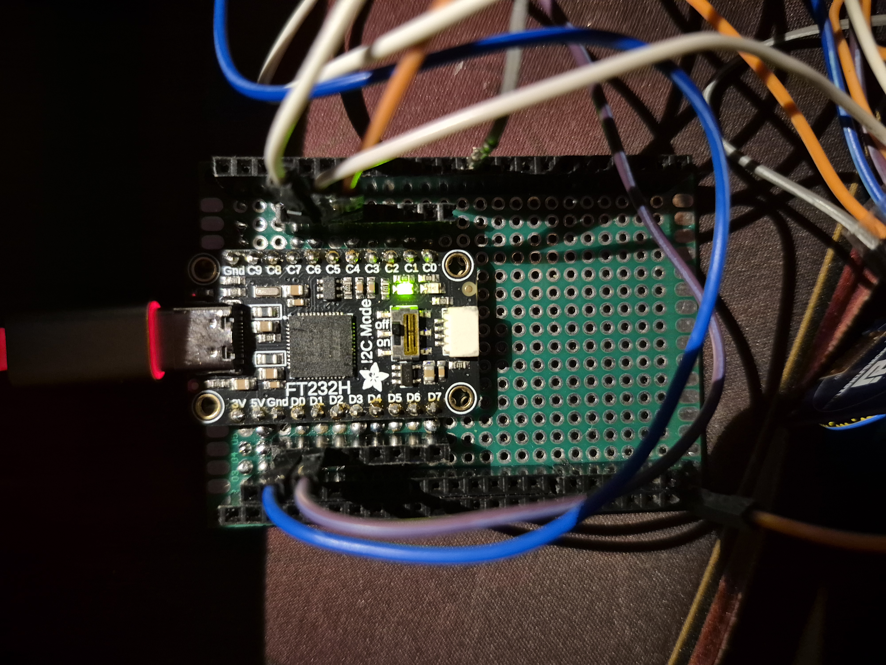

That breadboard setup is finally gone! 

I finally toke the time from my [previous build](https://bnzel.github.io/2025-04-07-NixOS-CyberDeck/) to solder everything together. 

I have been thinking for a while about how to keep my build compact, at first I just wanted to do the same old... Use a decent size protoboard and assemble them! But it didn't *feel* right, the whole idea of a cyberdeck was its portability. 

So I decided to make it **stackable**. But how? I was afraid of cramming electronics together and potentially breaking things, and in turn that would be difficult to troubleshoot *(I learned that the hard way...)*. After a few brainstorming sessions, I came up with the following:

## First Layer

This will only house the **FT232H** and provide pins as well as **5V**, **3.3V**, and **GND** rails. The left shows **VCC** and right is **GND**

## Second Layer

Here's where all of my **displays** and **sensors** are "snuggly" placed onto. Where the **BMP280** and **GPS** are placed is actually another protoboard held together with two screws and a rubber band! 

There was this strange issue where the I intialized **C7** as the **CS** pin of the **BMP280** at one point stopped working. I kept getting errors where the chip gets unrecognized, the values I got were ``0x0`` and ``0x20``. I solved this by switching to **D7**, I have yet to figure out why that is....

## Setup

Looks a bit better, right??

## Schematic

It's funny how I long I breadboard prototyped but didn't bother to draw the schematic until later. But here it is now!

**D4** is was suppose to initialize the webcam I had. I felt it didn't need to be there so I removed it.

## Demo

<video width="900" height="1600" controls>
  <source src="{{ '../assets/img/nixstick_update/demo.mp4' | relative_url }}" type="video/mp4">
</video>

## What's Next?
I have plans to field test this, just to make sure the GPS and barometric sensor is working as intended.