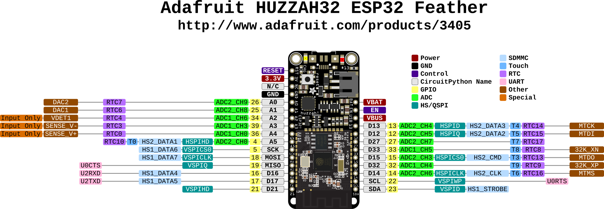
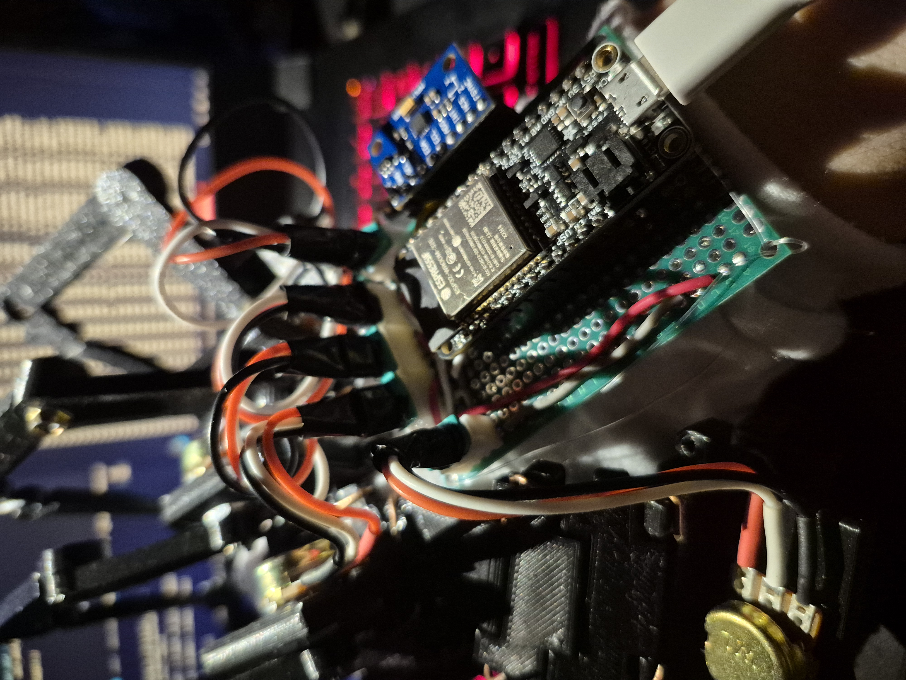

Another revisit to my sensor glove from my **[first version](https://bnzel.github.io/2024-11-13-Crude-Sensor-Glove/)**. 

This is a entire revamp! Instead of using the Arduino Nano, I moved to the [Adafruit Huzzah Feather ESP32](https://learn.adafruit.com/adafruit-huzzah32-esp32-feather?view=all). Why? To be honest I wanted to find a reason to learn about the ESP microcontrollers and I happen to find one. Also because I require connectivity which will be explained later.



I flashed it with [MicroPython](https://micropython.org/). Yea I could've used the [ESP-IDF](https://idf.espressif.com/) but since I am already familar with Python and needed some rapid prototyping, I might as well right? <sub>(don't worry I will return to **ESP-IDF**)</sub>

Here's the list of components I used:
### Hardware
* [Potentiometer Servo Controller Glove](https://www.thingiverse.com/thing:2782111)
* Adafruit Feather ESP32
* 5 rotary potentiometers
* 5 - 2 pin JST connectors
* [MPU9250](https://invensense.tdk.com/products/motion-tracking/9-axis/mpu-9250/)

It's not much but cause I'm still thinking about what else to add... I recently came across this [fascinating blog](https://theglovesproject.com/category/diy/) that documents **ALOT** about sensor gloves and that will be one of my main inspirations!

### Schematic And Notes


No... I didn't leave out the **vibration motors** <sub>(even though I kinda did?)</sub> and the reason for that was because I was planning to integrate this into **VR** for haptic feedback. I looked into [Unity](https://unity.com/solutions/vr) for VR support but since I am using **Linux** that currently isn't supported, so I then moved onto [Monado](https://monado.dev/) but I realized I am jumping too far without a concrete plan and decided that this will be an afterthought once I nail down the basics first.


This is just my ramblings written down. In the *hardware connections section*, the [HX711](https://www.sparkfun.com/sparkfun-load-cell-amplifier-hx711.html) and [load sensor](https://www.sparkfun.com/load-sensor-50kg-generic.html) was meant to be placed onto the palm of the glove and reads the weight of whatever I am holding.

In the *notes section*, since the ESP32 only provides 3.3V I will not be able to run hardware that's 5V, that's why I looked into [REF02](https://www.ti.com/lit/ds/symlink/ref02.pdf). Pressure mapping is an alternative for the load sensor but I don't know how I would be able to acheive something like that yet... I know there's [velostat](https://www.adafruit.com/product/1361) but I don't have it, what I do have is **conductive fabric**. I will have to look into this.

### Small Showcase


If you're wondering yes like the last glove I wrapped electrical tape around the fingers (not the wrist though!). This time it was fit the glove onto it.



I think I love electrical tape...

### Here's Me Testing It
<video width="640" height="360" controls>
  <source src="{{ '../assets/img/sensor_glove_v2/demo.mp4' | relative_url }}" type="video/mp4">
</video>

I wrote up a simple C server to listen to incoming connections on port 1234 from my ESP32. Whether it successfully connects to it or not, it will display data from the potentiometers and the MPU9250.

The library I used for the **[mpu9250](https://github.com/tuupola/micropython-mpu9250)**  

### The Code For The ESP32
```python
from machine import Pin, ADC, PWM, SoftI2C
from time import sleep
from mpu9250 import MPU9250 
from ak8963 import AK8963
from math import sqrt, atan2, pi, copysign, sin, cos
import socket

def init_network(choice=0):
    import network, time

    # to connect to a certain network
    network_creds = {
        0:["SSID1", "PASSWORD1"],
        1:["SSDID2", "PASSWORD2"]
    }

    if choice > len(network_creds):
        print(f"There are only {len(network_creds)}")
        return sta_if.isconnected()
    else:
        print(f"Connecting to {str(network_creds[choice][0])}")

        sta_if = network.WLAN(network.STA_IF); sta_if.active(True)
        sta_if.connect(str(network_creds[choice][0]),str(network_creds[choice][1]))

        timeout = 10
        while not sta_if.isconnected() and timeout > 0:
            print(f"{timeout} Attempt to connect...")
            time.sleep(1)
            timeout -= 1

        print(f"\n\nWiFi Connection: {sta_if.isconnected()}\nIP: {sta_if.ipconfig('addr4')}\n\n")

    return sta_if.isconnected()

def init_pot(pin_num):
    pot_AX = ADC(Pin(pin_num,Pin.IN))
    pot_AX.width(ADC.WIDTH_10BIT)
    pot_AX.atten(ADC.ATTN_11DB)    # 11DB for 3.3v
    return pot_AX

# https://stackoverflow.com/questions/70643627/python-equivalent-for-arduinos-map-function
def map_range(x, in_min, in_max, out_min, out_max):
    if in_max is 0 and out_max is 0:
        return x
    else:
        return (x - in_min) * (out_max - out_min) // (in_max - in_min) + out_min

def read_adc(adc_pin, sample=24, in_min=0, in_max=0, out_min=0, out_max=0):
    cumul = 0
    for _ in range(sample):
        cumul += adc_pin.read()
    return map_range(cumul, in_min, in_max, out_min, out_max)

# NOTE: revisit vibration motors 
def init_v_motors():
    v_mtr_1 = PWM(Pin(16), freq=1000, duty=512)
    v_mtr_2 = PWM(Pin(17), freq=1000, duty=512)
    v_mtr_3 = PWM(Pin(21), freq=1000, duty=512)
    v_mtr_4 = PWM(Pin(13), freq=1000, duty=512)
    v_mtr_5 = PWM(Pin(12), freq=1000, duty=512)

    return v_mtr_1, v_mtr_2, v_mtr_3, v_mtr_4, v_mtr_5

def init_mpu9250():
    i2c = SoftI2C(scl=Pin(22), sda=Pin(23))

    mpu9250 = MPU9250(i2c)
    sensor = mpu9250

    # check if "calibration_variables.txt" exists within root directory
    # read file and set precalibrated values
    # otherwise create the text file and calibrate
    try:
        with open("calibration_variables.txt","r") as file_calib_vars:

            print("file exists, reading...")
            cali_var_lines = file_calib_vars.readlines()

            offset = cali_var_lines[0]
            scale = cali_var_lines[1]

            print(f"\nOFFSET: {offset}\nSCALE: {scale}\n")

            ak8963 = AK8963(
                i2c,
                offset=offset,
                scale=scale
            )

    except OSError:
        print("file does not exist, creating 'calibration_variables.txt'...\nCalibrating MPU9250 Magnetometer...")

        file_calib_vars = open("calibration_variables.txt","a")
        ak8963 = AK8963(i2c)
        ak8963.calibrate()

        offset, scale = ak8963.calibrate(count=256, delay=200)
        file_calib_vars.write(f"{offset}\n{scale}")
        print(f"\nOFFSET: {offset}\nSCALE: {scale}\n")

        file_calib_vars.close()

        # NOTE: for some reason default params don't get recognized
        #       so fyi explicitly define them to avoid headaches
        sensor = MPU9250(i2c, None, ak8963)

    print("Done.")
    return sensor

# connects to port 1234 of C server
def establish_connection(ip=0):
    '''
    Attempts to connect to server to send glove data to
    '''
    ips = ['IP1', 'IP2']
    try:
        sockaddr = socket.getaddrinfo(str(ips[ip]),1234)[0][-1]
        print(f"\nConnecting to {sockaddr}...")

        soc = socket.socket()
        soc.connect(sockaddr)

        print(soc.recv(1024))
        
        return soc

    except OSError as e:
        print(f"Connection failed: {e}\nClosing socket...")
        soc.close()
        return None

def sock_send_data(sock):
    '''
    Sends potentiometer data and MPU9250's accelerometer data
    '''
    if sock is not None:
        x = mpu9250.acceleration[0]
        y = mpu9250.acceleration[1]
        z = mpu9250.acceleration[2]

        return sock.send(f"{read_adc(pot_A2,1)},\
                        {read_adc(pot_A3,1)},\
                        {read_adc(pot_A4,1)},\
                        {read_adc(pot_D32,1)},\
                        {read_adc(pot_D33,1)},\
                        {x},\
                        {y},\
                        {z}".encode()
                        )

def test_hardware(test_case=0):
    '''
    Debug just the hardware without connecting to the server\n
    0: potentiometer\n
    1: mpu9250\n
    2: all
    '''
    component_x = {
        0: f"A2: {read_adc(pot_A2,1)} | A3: {read_adc(pot_A3,1)} | A4: {read_adc(pot_A4,1)} | D32: {read_adc(pot_D32,1)} | D33: {read_adc(pot_D33,1)}".encode(),
        1: f"ACCEL: {mpu9250.acceleration} | GYRO: {mpu9250.gyro} | MAG: {mpu9250.magnetic} | TEMP: {mpu9250.temperature}".encode(),
        2: f"A2: {read_adc(pot_A2,1)} | A3: {read_adc(pot_A3,1)} | A4: {read_adc(pot_A4,1)} | D32: {read_adc(pot_D32,1)} | D33: {read_adc(pot_D33,1)} | ACCEL: {mpu9250.acceleration} | GYRO: {mpu9250.gyro} | MAG: {mpu9250.magnetic} | TEMP: {mpu9250.temperature}"
    }
    return print(component_x[test_case])


net_stat = init_network(0)

# continue whether or not it's connected to wifi
# or connected to local server so 
# it can be used for field testing
if net_stat or not net_stat:
    pot_A2 = init_pot(34)
    pot_A3 = init_pot(39)
    pot_A4 = init_pot(36)
    pot_D32 = init_pot(32)
    pot_D33 = init_pot(33)

    # init_v_motors()
    
    mpu9250 = init_mpu9250()
    print(f"MPU9250 ID: {hex(mpu9250.whoami)}")
    
    sock = establish_connection(0)

    while True:  

        if sock is None:
            test_hardware(2)
        else:
            sock_send_data(sock)
            
        sleep(0.1)
```
