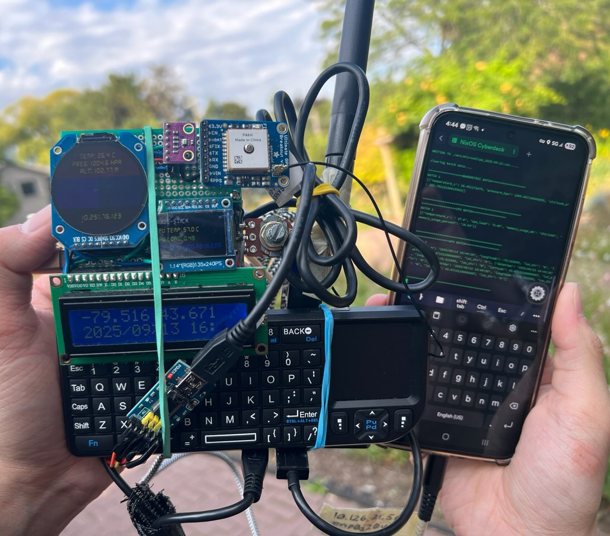
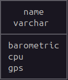
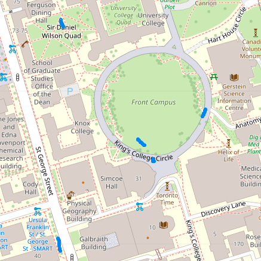
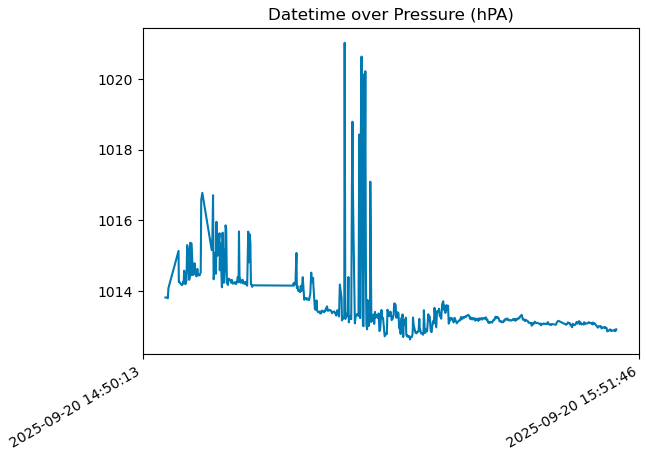
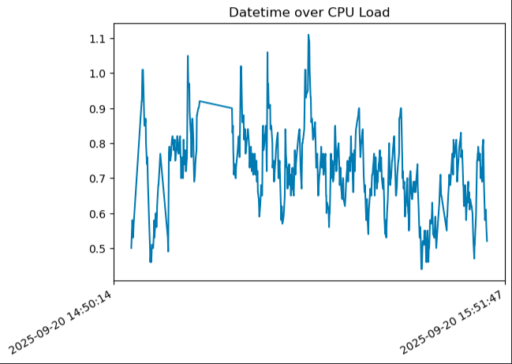

There's alot to uncover here. Let's break it down.

### What more can you possibly add to the NixStick?

Maybe not anymore hardware - *maybe...* But I have documenting my work more formally. I even redrew my schematic so it looks "cleaner". 

The most important are the software and hardware architecture block diagrams as this explains my current setup. Note that these are overviews so more details will be on my **[GitHub](https://github.com/BnZel/NixOS_CyberDeck)**.

Here is how I jot down my thought process. The hardware (red) that is running the cyberdeck and what software (green) is supporting it. The **"CYBERDECK BUILD (NIXOS 24.05)"** block references the schematic I recently revised. 

If you recall the **[ESP32 glove (Sensor Glove V2)](https://bnzel.github.io/2025-07-10-Sensor-Glove-V2/)** block, I ported the **TCP C server code** to the cyberdeck. Right now there isn't any updates to this but I will return to it soon!

Here's the redrawn schematic:

### So... That's it?
**WAIT!** I also finally field tested the NixStick. Collecting **GPS**, **Barometric**, and monitoring **CPU stats**. 

Oh yeah the phone. Since I don't have a display *(which is funny since there are 3 displays)* to navigate the terminal. I used a **USB-A to USB-C cable** connected to my USB hub and to my phone. I use **[Termux](https://termux.dev/en/)** to login and start the program.

I swapped to a USB hub with a external power supply as I noticed alot of overvoltage.

*yes the rubber bands are necessary to keep my board from falling...*

### What else?

You won't believe it, but I used another Intel Compute Stick *(sorry not sorry)* called **[NixExp (NixOS Experimental)](https://github.com/BnZel/NixOS_CyberDeck/tree/main/analysis)**. The purpose is to have a portable **database** and **data analysis** workstation.

This is my current setup:

*actually sorry for drawing the database tables this way*

### DuckDB (embedded database)
Reason for using **[DuckDB](https://duckdb.org/)** was for its easy **[geospatial data handling](https://motherduck.com/blog/geospatial-for-beginner-duckdb-spatial-motherduck/)** that was needed to work around my GPS longitude and latitude coordinates.

The tables I have so far:

### Python
Now with that in mind, I needed to plot those coordinates on a map. So I opted for **[GeoPandas](https://geopandas.org/en/stable/about.html)**. 

A sample of me walking around University Of Toronto:

Now for plotting the **barometric** and **cpu** data. I used **[matplotlib](https://matplotlib.org/)**. Here are one of the samples:

#### Barometric

#### CPU
