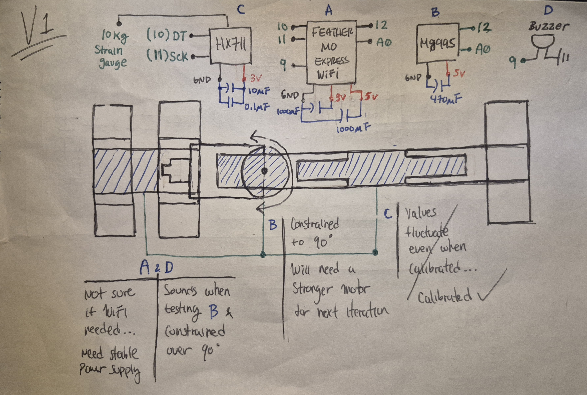
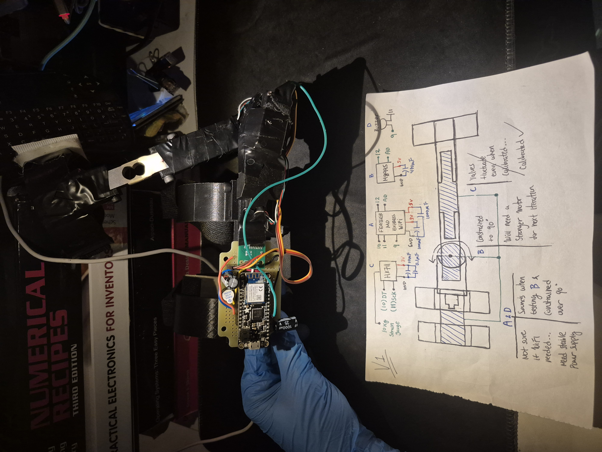

I always have been curious about how exoskeletons work but searching for learning materials comes with a big prerequisite of knowledge. However upon discovering **[EduExo](https://www.auxivo.com/eduexo)**, it gave me a good place to start. 

I started with **[EduExo Maker](https://www.auxivo.com/eduexo-maker)** as that was open source. They have provided all code and STL files and a handbook.

But of course I decided to branch off a bit...

### Hardware
* EduExo
* [Adafruit Feather M0 WiFi - ATSAMD21 + ATWINC1500](https://www.adafruit.com/product/3010) 
* MG995R Servo
* 10 kg strain gauge load cell
* HX711 load cell amplifier

A strain gauge measures mechanical force and converts that into an electrical signal. There are [different kinds of load cells](https://www.futek.com/strain-gauge-load-cell). The **[HX711](https://learn.adafruit.com/adafruit-hx711-24-bit-adc)** helps interface the load cell easily and provides accurate measurements.

The handbook says to get an [analog feedback servo](https://learn.adafruit.com/analog-feedback-servos). They have feedback on what position they are in. I did not have one on hand *(you think I would)* so I instead used the MG995R and modified that to have feedback.

### Schematic & Diagram


It wouldn't be a good project without issues! 

I experienced fluctuating values when measuring force even when I calibrated it. Luckily I found an **[example from SparkFun](https://learn.sparkfun.com/tutorials/load-cell-amplifier-hx711-breakout-hookup-guide/all#arduino-example)** that **FINALLY** calibrated my load cell.

There was also this *weird* issue where the servo locked up from the **5V power supply** coming from the M0. Eventually it worked out and it was the way I setup the servo position...

To avoid any flucations to power and the modules, I added a few capacitors to smooth them out.

I wanted to continue on with this version but the PLA proved too fragile and has damaged several parts of the exo arm to which I had to super glue and electrical tape to hold it up. The next version will have improvements.

### Software

As you can see the **PID** header I wrote was a follow up but as mentioned I had put it on hold.

```cpp
#include <PID.h>

#include <SPI.h>
#include <HX711.h>
#include <Servo.h>

// piezo buzzer
#define BUZZER_PIN           9

// servo configurations
#define FEEDBACK_SERVO_PIN   A0
#define PWM_SERVO_PIN        12
#define MIN_DEGREES          0
#define MAX_DEGREES          180
#define CONSTRAIN_DEGRESS    110    

// HX711 configurations
#define DT                   10
#define SCK                  11
#define READING              -44000.00         // based on calibration result   | 479.0, -60.41
#define TEST_FLAG            1              // 0 to calibrate || 1 to ignore
#define KNOWN_WEIGHT         1.034           // in grams (change accordingly) | 27.0, 1.034 kg

HX711 hx711;
float hx711Calibration;

// servo
Servo servo;
int servoPos;
int feedbackPos;
int minDegrees;
int maxDegrees;
int minFeedback;
int maxFeedback;
int tolerance;

// PID controller
struct PID pid;
float integ;
long interval;
long prevTime;
long currTime;
float ut; 


void hx711Calibrate()
{
  if(TEST_FLAG == 0)
  {
    hx711.set_scale();    
    Serial.println("Tare... remove any weights from the scale.");
    delay(5000);

    hx711.tare();
    Serial.println("Tare done...");
    Serial.print("Place a known weight on the scale...");
    delay(5000);

    long reading = hx711.get_units();
    Serial.println("Result:\n");
    Serial.print(reading);

    hx711Calibration = reading/KNOWN_WEIGHT;
    Serial.println("Calibrated value:\n");
    Serial.print(hx711Calibration);
  }
  else
  {
    hx711Calibration = READING / KNOWN_WEIGHT;
    Serial.println("HX711 ALREADY CALIBRATED....");
    Serial.println("Result:\n");
    Serial.print(hx711Calibration);
  }
}

void servoTest()
{
  // beep test before 
  // proceeding to test
  for(int i=0; i<4; i++)
  {
    tone(BUZZER_PIN, 1000,50);
    delay(200);
    noTone(BUZZER_PIN);
  }
  servo.write(100);
  delay(1000);
  servo.write(0);
  delay(1000); 
  servo.write(100);
  delay(1000);
}

void setup() {
  Serial.begin(115200); // 115200 9600  

  pinMode(BUZZER_PIN, OUTPUT);

  servo.write(100);
  servo.attach(PWM_SERVO_PIN);
  servoTest();
  servo.detach();

  hx711.begin(DT,SCK);
  hx711Calibrate();
  hx711.tare();

}

void loop() 
{
  hx711.set_scale(hx711Calibration);

  if(hx711.is_ready())
  {
    feedbackPos = constrain(map(analogRead(FEEDBACK_SERVO_PIN),0,1023,MIN_DEGREES,MAX_DEGREES),MIN_DEGREES,MAX_DEGREES);

    Serial.print(">Servo Feedback:");
    Serial.println(feedbackPos);  

    Serial.print(">HX711 Units:");
    Serial.println(hx711.get_units(),1);

    // Serial.print(">HX711 Average:");
    // Serial.println(hx711.read_average(1),1);

    // safety check (0 - 90 deg arm bend) 
    // resets back resting position (96 deg)
    if(feedbackPos > CONSTRAIN_DEGRESS)
    {
      tone(BUZZER_PIN, 1000);

      if(!servo.attached())
      {
        servo.attach(PWM_SERVO_PIN);
        servo.write(100);
      }
      else
      {
        servo.write(100);
      }

      delay(350);
      noTone(BUZZER_PIN);
      servo.detach();
    }
  }
}
```
### Demo
A simple sweep test



*(don't mind the books and the electrical tape...)*