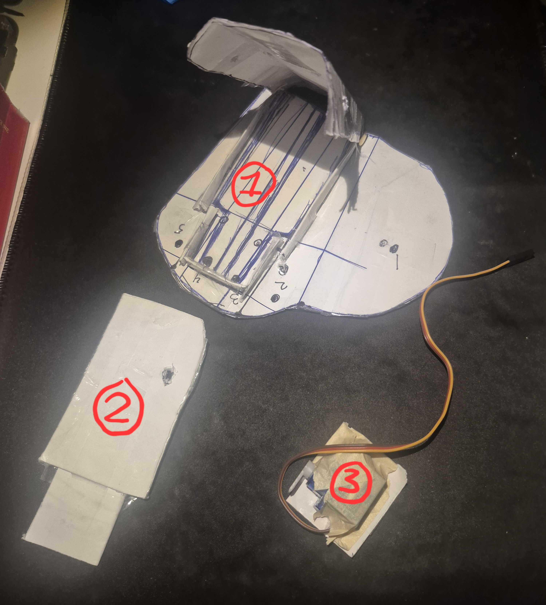
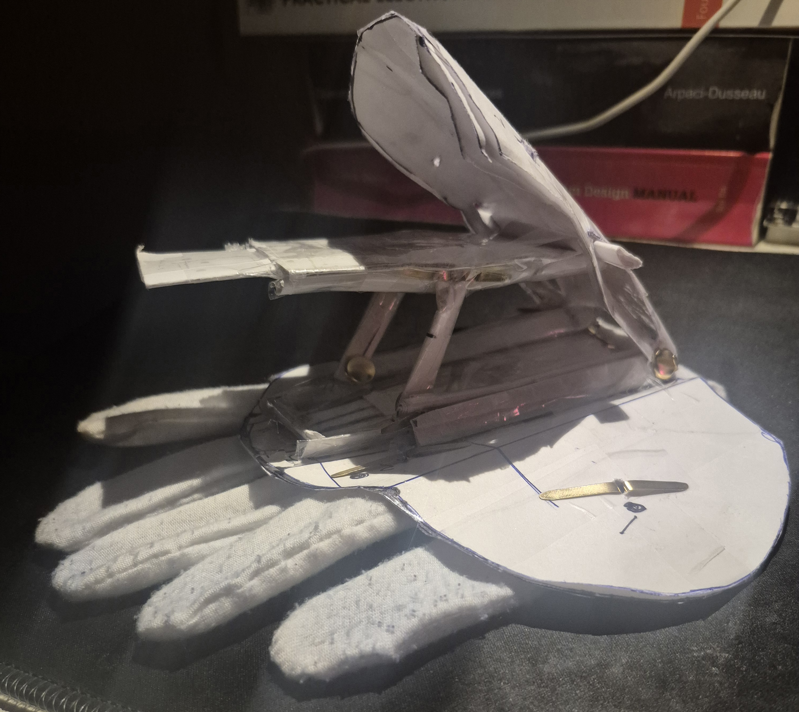
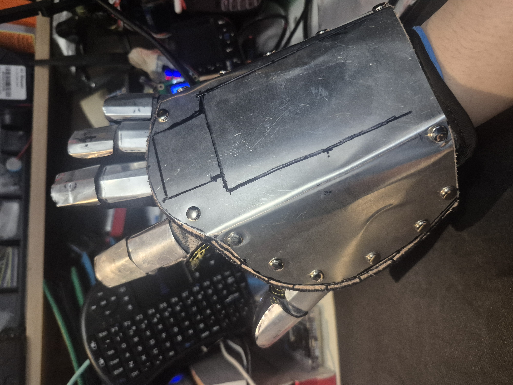

Now this is something different!

I would be lying if I said I wasn't heavily inspired by the Iron Man movies. I just love how all the moving mechanical parts work! Plus I wanted to make one for the longest time.

Here's the final product <small>*(ignore my messy workstation)*</small>:

Let's start from the beginning...

### Crude Beginnings

Just to test things out, I had the **BRIGHT** idea of using stacked printer paper to make the parts (I later realized using cardboard was a better idea due to it having more structure to model).

Anyways here's the list of parts:

1. What I like to call the **shield** covering the back of my hand with an open and close mechanism.

2. The plate where it would extend out when the shield opens. I don't know what this is really used for but I can always swap it out for something else.

3. A small servo motor for myself to determine where to place it on the glove for the mechanism.

### Here It Is...

I toke *some* time trying to understand what linkage mechanism I need for both to work. 

### Time for Metal work!
I used **aluminium flashing** because it's thin, easy to cut, and can bend into mostly any shape. Because I created the model first, I can now follow that. I used vegetable tan leather to rivet onto the aluminium.

The gloves are just regular work gloves and I super glued the same aluminium flashing that I cut and bent to the shape of my fingers. Don't forget to sand them down! I was fortunate enough to only get a few hard scratches...

Here's the full product! Oh yeah the linkage, it finally came to me after I assembled the whole thing. There was this **[website](https://507movements.com/)** that has alot of mechanical movement references. The one I spent time figuring out was **[this](https://507movements.com/mm_325.html)**.

### Demos

