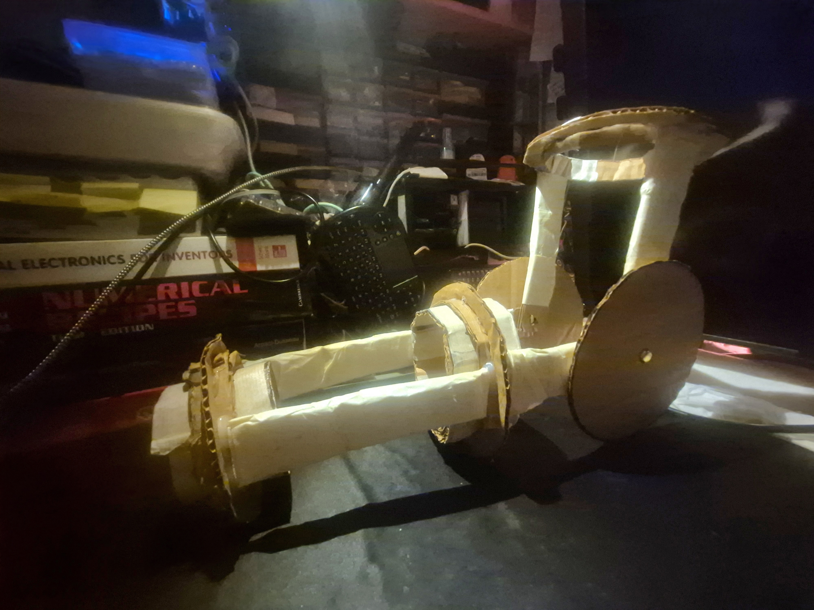
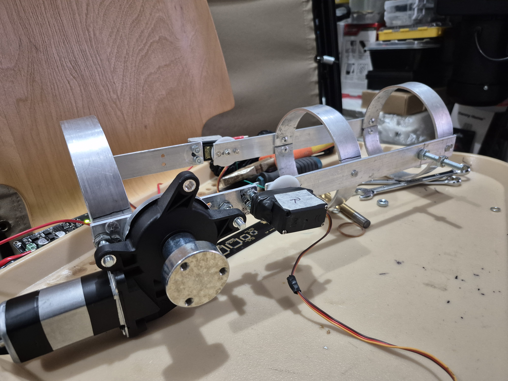
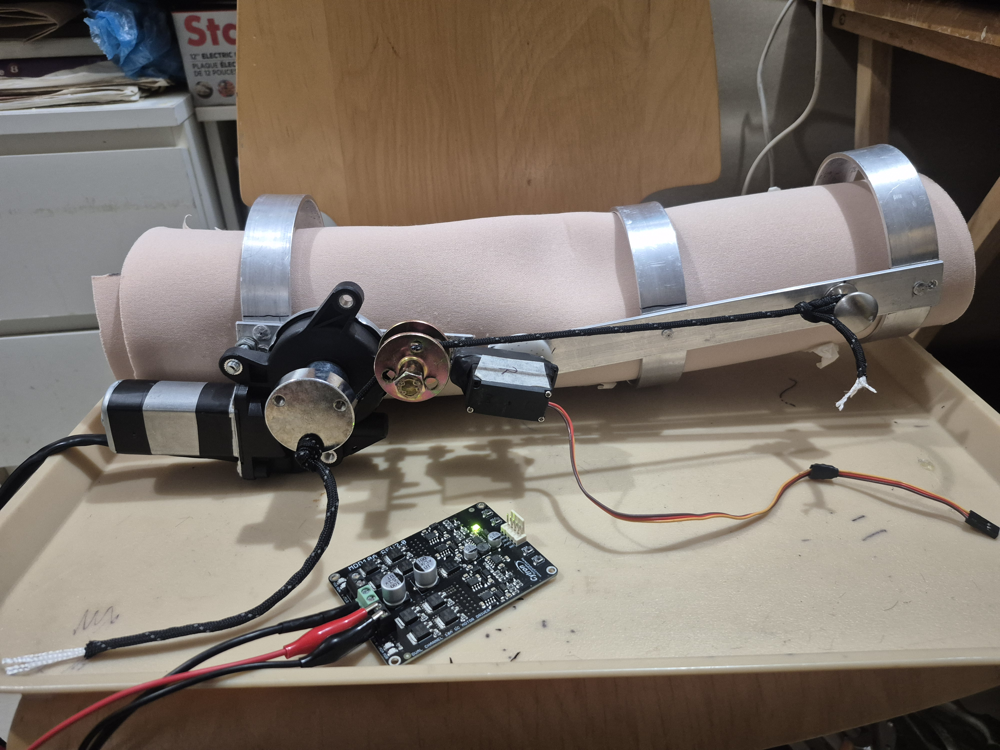

I didn't want to stop at the **[first build](https://bnzel.github.io/2026-02-02-EduExo/)** so *naturally* I continued by working with metal! *<small>(foreshadow incoming...)</small>* Since this is fairly new to me I had **ALOT** of help to figure out the materials and tools.

Since knowing I should model things using cardboard, I made a model of what I think the arm should look like.

My plan was to have an **HX711** with a **30kg load cell** and two **MG995R** servos on the elbow joints for lifting small loads (which to be honest doesn't make any difference now that I think about it...) and determining rotational position (modded one to have a feedback wire) while a **Cytron Power Window Motor** with **Cytron SmartDriveDuo Smart Dual Channel 10A Motor Driver** driving it, assists in lifting the exceed rate of the two servos. It would have a strong **550 paracord** wrapped around the wheel of the motor to pull the lower arm up.

It looked good on paper but after building the whole thing I realized you need to be strict on the mechanics and have proper calculations before jumping in.

So yeah after all the trial and error, this is what it looks like. 

Looks far from the model right?

I cannot explain the countless trips to hardware stores because we were missing a specific screw or we need a smaller aluminium flat, etc. Not only that we had to drill so many holes because we accidentally drilled that side or the servo horn is grinding against the metal so we need spacing between the upper arm and the lower arm... Yeah you get it idea.

Unfortunately the results were not what we expected. It did not achieve the desired lift and most of the weight was not properly distributed upon flexing so it was rendered useless and added extra weight. Maybe the window motor wasn't strong enough? Maybe the way we placed things lacked mechanical advantage? There's still lots of questions.

But it looks cool though, right?

Although it wasn't successfull, I still learned alot about exoskeletons and will continue looking into this.

